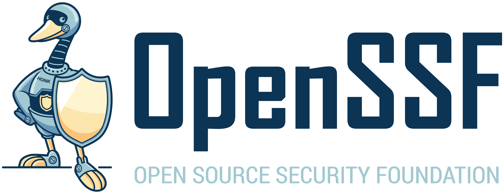

##########
Jon Zeolla
##########
.. image:: img/linkedin.png
  :alt: Jon Zeolla LinkedIn
  :target: https://linkedin.com/in/jonzeolla/
  :width: 20px

.. image:: img/twitter.png
  :alt: Jon Zeolla Twitter
  :target: https://twitter.com/jonzeolla
  :width: 20px

.. image:: img/github.png
  :alt: Jon Zeolla GitHub
  :target: https://github.com/jonzeolla/
  :width: 20px

Welcome to my page!

I ❤️ cloud native security & compliance

Right now I'm spending *most* of my time building |seiso| and contributing in the |cncf| and |ossf|, although I'm also
having fun working on |easy_infra|.

If you're here for a lab, `click here <labs/index.html>`_.

You can also find a bit about my background `here <about-me.html>`_.

.. |cncf| image:: img/cncf.png
  :height: 3ex
  :target: https://www.cncf.io/

.. |easy_infra| image:: img/easy_infra.png
  :height: 5ex
  :target: https://github.com/SeisoLLC/easy_infra

.. toctree::
   :maxdepth: 2
   :hidden:

   labs/index
   about-me
   ref/jz-content
