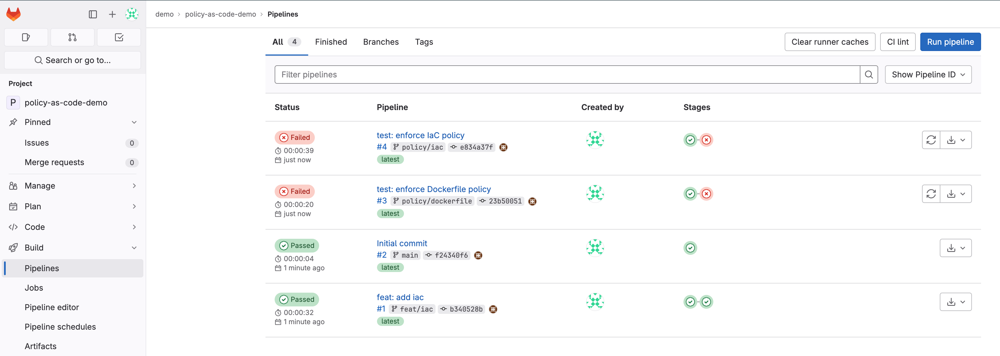
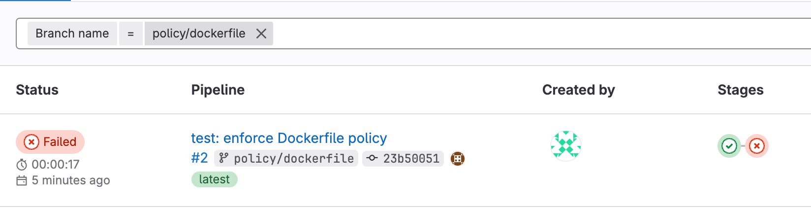
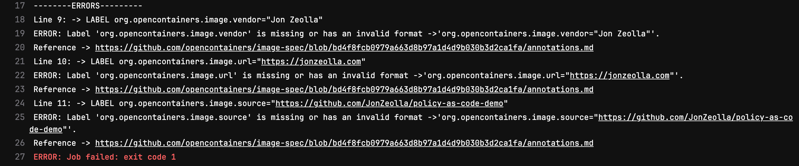
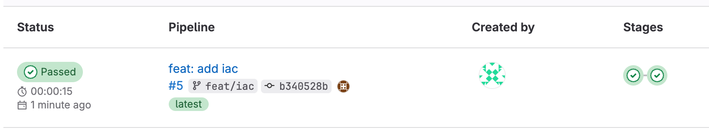
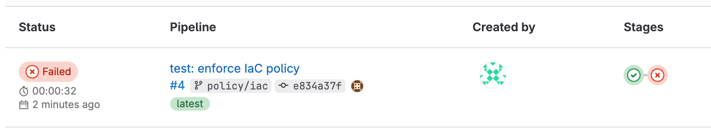

# Policy as Code

Welcome to my Policy as Code workshop!

The Cloud is enabling businesses to quickly adopt and use technology in ways that we've never imagined before. Security teams need to find ways to keep up;
automation is the solution. By using Policy as Code tools we can define and enforce security guardrails. This allows developers and cloud engineers to continue
shipping features while bringing the confidence to everybody that security requirements are being met.

In this lab, we get hands-on with pipelines and container runtimes, learn how to distribute the enforcement of our Governance, and centralizing our
observability of the environment.

## Agenda

```{toctree}
---
caption: Agenda
maxdepth: 1
---
```

1. [Getting started](getting-started)
1. [PaC in Pipelines](pac-in-pipelines)
1. [Example 1 - Dockerfiles](dockerfiles)
1. [Example 2 - Infrastructure as Code](infrastructure-as-code)

## Getting started

```{important}
This lab expects that you have an AWS Cloud9 environment configured. Step by step instructions to create a Cloud9 environment are available
<a href="../ref/aws_cloud9.html" target="_blank" rel="noopener">here</a>.
```

Run the following inside your Cloud9 IDE to setup the lab environment:

First, configure the IP variable with your public IP - to find it, [go here](https://ipv4.icanhazip.com/).

```{code-block} bash
---
class: getting-started
---
export CLIENT_IP=X.X.X.X # TODO: Replace this with your IP
```

Now, run the lab setup container.

```{code-block} bash
---
class: getting-started
---
docker run -e C9_PROJECT -e CLIENT_IP -e HOST_USER="${USER}" --network host -v ~/logs:/root/logs -v ~/.ssh:/root/.ssh jonzeolla/labs:policy-as-code
```

Then, you will need to wait for a while as the automation configures your enviornment. At the end you should see a message like this:


Use the provided credentials and URL to login to the GitLab instance. You're now ready to get started on the lab!

## Terminology

- **Governance** is the process of making and enforcing decisions within an organization, and includes the process of choosing and documenting how an
  organization will operate.
- A **Policy** is a statement of intent to be used as a basis for making decisions, generally adopted by members of an organization. Policies are often
  implemented as a set of standards, procedures, guidelines, and other blueprints for organizational activities.
- **Policy as Code (PaC)** is the use of software and configurations to programmatically define and manage rules and conditions. Examples of popular languages used to
  implement Policy as Code include YAML, Rego, Go, and Python.

For more background on cloud native policy as code, see the CNCF white papers on
[Policy](https://github.com/kubernetes/sig-security/blob/769edfa3fbcbefcf8a4a1c623ee3fe486724a17f/sig-security-docs/papers/policy/CNCF_Kubernetes_Policy_Management_WhitePaper_v1.pdf)
and
[Governance](https://github.com/kubernetes/sig-security/blob/769edfa3fbcbefcf8a4a1c623ee3fe486724a17f/sig-security-docs/papers/policy_grc/Kubernetes_Policy_WG_Paper_v1_101123.pdf).

## PaC in Pipelines

Policy as Code applies across the entire lifecycle of development, from early software design and development, building and distributing code and images,
deployment of those artifacts, and finally production runtime. In this lab, we will be focusing on Policy as Code tooling that can be used in pipelines to
detect and prevent mistakes from being deployed to production.

We will be using a very simple demo repository foro this lab, which has already been cloned in `~/environment/policy-as-code-demo`. Go ahead and open this
folder in your Cloud9 IDE and take a brief look around.

First, we need to push this new repository into our GitLab environment. I've pre-created an SSH private key in `~/.ssh/gitlab` and a public key in
`~/.ssh/gitlab.pub`, as well as a configuration in `~/.ssh/config`. Feel free to examine these manually.

Now you can follow [these steps](https://docs.gitlab.com/ee/user/ssh.html#add-an-ssh-key-to-your-gitlab-account) to add your SSH public key to your user in
GitLab.

Once that's complete, run the following commands to push the `policy-as-code-demo` into GitLab.

```{code-block} console
$ export EXTERNAL_IP="$(grep ^Host ~/.ssh/config | awk '{print $2}')"
$ ssh-keyscan -p 2222 "${EXTERNAL_IP}" >> "${HOME}/.ssh/known_hosts"
$ cd ~/environment/policy-as-code-demo
$ git fetch --all
$ git remote remove origin
$ git remote add origin ssh://git@${EXTERNAL_IP}:2222/demo/policy-as-code-demo.git
$ git push --all origin
Enumerating objects: 6, done.
Counting objects: 100% (6/6), done.
Delta compression using up to 4 threads
Compressing objects: 100% (4/4), done.
Writing objects: 100% (6/6), 1.82 KiB | 1.82 MiB/s, done.
Total 6 (delta 0), reused 5 (delta 0), pack-reused 0
To ssh://3.134.105.97:2222/demo/policy-as-code-demo.git
 * [new branch]      main -> main
```

You can now open up GitLab and browse to the `policy-as-code-demo` pipelines. It should look a little something like this:



:::{admonition} Can't find it?
---
class: dropdown hint
---
If you're having a hard time finding the `policy-as-code-demo` repo, and the corresponding pipeline, try going to the below URL:
```{code-block} bash
export EXTERNAL_IP="$(grep ^Host ~/.ssh/config | awk '{print $2}')"
echo "http://${EXTERNAL_IP}/root/policy-as-code-demo/-/pipelines"
```
:::

Now that we have an initial project in place, and our pipelines are working, let's simulate a little real-world activity.

### Dockerfiles

If took a look at our repository, you likely noticed a `Dockerfile`. `Dockerfile`s are a set of instructions for docker to use to build a container image. In
most cases, when you build an image, especially when on behalf of a company, you'd like to ensure that certain fields are always set. One such set of standard
fields are the OCI Image spec's [pre-defined annotation
keys](https://github.com/opencontainers/image-spec/blob/93f6e65855a1e046b42afbad0ad129a3d44dc971/annotations.md#pre-defined-annotation-keys).

First, let's look at the existing `Dockerfile`:

```{code-block} Dockerfile
---
class: no-copybutton
---
FROM ubuntu:22.04

ARG VERSION
ARG COMMIT_HASH

LABEL org.opencontainers.image.title="A Policy as Code demo"
LABEL org.opencontainers.image.description="A Policy as Code demonstration repository"
LABEL org.opencontainers.image.version="${VERSION}"
LABEL org.opencontainers.image.vendor="Jon Zeolla"
LABEL org.opencontainers.image.url="https://jonzeolla.com"
LABEL org.opencontainers.image.source="https://github.com/JonZeolla/policy-as-code-demo"
LABEL org.opencontainers.image.revision="${COMMIT_HASH}"
LABEL org.opencontainers.image.licenses="NONE"

ENTRYPOINT echo "Hello, World!"
```

This is a very straightforward image that will just print "Hello, World!" when we run it.

```{admonition} Learn more
---
class: seealso
---
To see the `Dockerfile` specification, see the documentation [here](https://docs.docker.com/engine/reference/builder/).
```

In it we can see that some fields are set, including a `vendor` of "Jon Zeolla". Perhaps this project was done by Jon, but on behalf of his company and as an
organization we'd like all of our developers to specify the correct organizational attribution in the `vendor` field. We can enforce that with Policy as Code!

First, let's take a look at our policy definition for `Dockerfile`s:

```
---
profile:
  name: "Require OCI Annotations"
  description: "Require Example Company's minimum OCI annotations"
line_rules:
  LABEL:
    paramSyntaxRegex: /org\.opencontainers\.image\..+/
    defined_namevals:
      org.opencontainers.image.authors:
        valueRegex: /.+/
        message: "Label 'org.opencontainers.image.authors' is missing or has an invalid format"
        level: "error"
        required: false
        inverse_rule: true
        reference_url:
          - "https://github.com/opencontainers/image-spec/blob/bd4f8fcb0979a663d8b97a1d4d9b030b3d2ca1fa/annotations.md"
      org.opencontainers.image.licenses:
        valueRegex: /^(NONE|MIT|BSD-3-Clause)$/
        message: "Label 'org.opencontainers.image.licenses' is invalid"
        level: "error"
        required: true
        inverse_rule: true
        reference_url:
          - "https://github.com/opencontainers/image-spec/blob/bd4f8fcb0979a663d8b97a1d4d9b030b3d2ca1fa/annotations.md"
          - "https://spdx.org/licenses/"
          - "https://github.com/spdx/spdx-spec/issues/49"
      org.opencontainers.image.vendor:
        valueRegex: /^Example$/
        message: "Label 'org.opencontainers.image.vendor' is missing or has an invalid format"
        level: "error"
        required: true
        inverse_rule: true
        reference_url:
          - "https://github.com/opencontainers/image-spec/blob/bd4f8fcb0979a663d8b97a1d4d9b030b3d2ca1fa/annotations.md"
      org.opencontainers.image.version:
        valueRegex: /(.+\..+\..+(-.+)?|\$\{VERSION\}(-.+)?|\$VERSION(-.+)?|([0-9a-f]{7,40}|\$\{COMMIT_HASH\}|\$COMMIT_HASH))/
        message: "Label 'org.opencontainers.image.version' is missing or has an invalid format"
        level: "error"
        required: true
        inverse_rule: true
        reference_url:
          - "https://github.com/opencontainers/image-spec/blob/bd4f8fcb0979a663d8b97a1d4d9b030b3d2ca1fa/annotations.md"
      org.opencontainers.image.title:
        valueRegex: /.+/
        message: "Label 'org.opencontainers.image.title' is missing or has an invalid format"
        level: "error"
        required: true
        inverse_rule: true
        reference_url:
          - "https://github.com/opencontainers/image-spec/blob/bd4f8fcb0979a663d8b97a1d4d9b030b3d2ca1fa/annotations.md"
      org.opencontainers.image.description:
        valueRegex: /.+/
        message: "Label 'org.opencontainers.image.description' is missing or has an invalid format"
        level: "error"
        required: true
        inverse_rule: true
        reference_url:
          - "https://github.com/opencontainers/image-spec/blob/bd4f8fcb0979a663d8b97a1d4d9b030b3d2ca1fa/annotations.md"
      org.opencontainers.image.url:
        valueRegex: /https:\/\/example.com.*/
        message: "Label 'org.opencontainers.image.url' is missing or has an invalid format"
        level: "error"
        required: true
        inverse_rule: true
        reference_url:
          - "https://github.com/opencontainers/image-spec/blob/bd4f8fcb0979a663d8b97a1d4d9b030b3d2ca1fa/annotations.md"
      org.opencontainers.image.source:
        valueRegex: /https:\/\/example.com\/demo\/.+/
        message: "Label 'org.opencontainers.image.source' is missing or has an invalid format"
        level: "error"
        required: true
        inverse_rule: true
        reference_url:
          - "https://github.com/opencontainers/image-spec/blob/bd4f8fcb0979a663d8b97a1d4d9b030b3d2ca1fa/annotations.md"
      org.opencontainers.image.revision:
        valueRegex: /([0-9a-f]{7,40}|\$\{COMMIT_HASH\}|\$COMMIT_HASH)/
        message: "Label 'org.opencontainers.image.revision' is missing or has an invalid format"
        level: "error"
        required: true
        inverse_rule: true
        reference_url:
          - "https://github.com/opencontainers/image-spec/blob/bd4f8fcb0979a663d8b97a1d4d9b030b3d2ca1fa/annotations.md"
```

Well, that was a lot. Feel free to look closer, or continue on with the lab.

```{admonition} Look Closer
---
class: seealso dropdown
---
If you look closely, you'll see some other policies being enforced here. Sometimes we are requiring that a field be dynamic, such as the
`org.opencontainers.image.revision`, but even when it's dynamic it can be a very structured way. In this case, we're saying it can be hard coded, but if so it
needs to be either 7 or 40 characters of hex, or it can be passed in with a build argument named `COMMIT_HASH`.
```

Let's have a look at our pipelines relating to this code. Run the following command, and then open the resulting URL in your host web browser.

```{code-block} console
$ export EXTERNAL_IP="$(grep ^Host ~/.ssh/config | awk '{print $2}')"
$ echo "http://${EXTERNAL_IP}/demo/policy-as-code-demo/-/pipelines?page=1&scope=branches&ref=policy%2Fdockerfile"
http://18.191.159.152/demo/policy-as-code-demo/-/pipelines?page=1&scope=branches&ref=policy%2Fdockerfile
```

You should see something like this - the pipeline failed! But, why did it fail?



If you dig in further to the failed `policy` job, we can see why:



It appears that this project didn't match our company's policy. The vendor, url, and source specified do not contain our Example company's allowed information,
and so we fail the build to indicate to the developer(s) that this needs to be remedied.

Notice, though, that not all was wrong with this code change. What fields were set properly?

:::{admonition} Answer
---
class: dropdown hint
---
Actually, there were quite a few fields properly set:

```{code-block} bash
---
class: no-copybutton
---
org.opencontainers.image.authors
org.opencontainers.image.licenses
org.opencontainers.image.version
org.opencontainers.image.title
org.opencontainers.image.description
org.opencontainers.image.revision
```

Some of these had specific policies, such as requiring certain formats or contents, whereas others simply need to be set, but their contents are able to be any
freeform text.
:::

### Infrastructure as Code

Now, let's look at a different kind of policy. One that we're all likely familiar with; security scans.

If we take a look at the `feat/iac` branch and go to the `iac/` folder, we see that a developer has been hard at work adding some Infrastructure as Code to our
project. Specifically this `iac/main.tf` file:

```{code-block} terraform
---
class: no-copybutton
---
data "aws_ami" "ubuntu" {
  most_recent = true

  filter {
    name   = "name"
    values = ["ubuntu/images/hvm-ssd/ubuntu-focal-20.04-amd64-server-*"]
  }

  filter {
    name   = "virtualization-type"
    values = ["hvm"]
  }

  owners = ["099720109477"]
}

resource "aws_instance" "web" {
  ami           = data.aws_ami.ubuntu.id
  instance_type = "t3.micro"

  tags = {
    Name = "HelloWorld"
  }
}

provider "aws" {
  region  = "us-east-1"
}
```

And, if we look at the related pipeline, we should also see that they succeeded in getting the coveted green checkmark:



:::{admonition} Can't find it?
---
class: dropdown hint
---
If you're having a hard time finding the `feat/iac` pipeline, run the following and then open the displayed URL in the host browser:
```{code-block} bash
$ export EXTERNAL_IP="$(grep ^Host ~/.ssh/config | awk '{print $2}')"
$ echo "http://${EXTERNAL_IP}/demo/policy-as-code-demo/-/pipelines?page=1&scope=branches&ref=feat%2Fiac"
http://18.191.159.152/demo/policy-as-code-demo/-/pipelines?page=1&scope=branches&ref=feat%2Fiac
```
:::

But how do we know that EC2 server is configured securely? Well, so far we don't.

Let's look at how we can add some Policy scans into our pipeline, using an open source tool `easy_infra`.

Go to the pipeline associated with the `policy/iac` branch now. You should see something like this:



:::{admonition} Can't find it?
---
class: dropdown hint
---
If you're having a hard time finding the `feat/iac` pipeline, run the following and then open the displayed URL in the host browser:
```{code-block} bash
$ export EXTERNAL_IP="$(grep ^Host ~/.ssh/config | awk '{print $2}')"
$ echo "http://${EXTERNAL_IP}/demo/policy-as-code-demo/-/pipelines?page=1&scope=branches&ref=policy%2Fiac"
http://18.191.159.152/demo/policy-as-code-demo/-/pipelines?page=1&scope=branches&ref=policy%2Fiac
```
:::

```{admonition} Answer
---
class: dropdown hint
---
The pipeline should fail due to some security findings.

Our policy is that all EC2 instances must use encrypted EBS volumes, and the configuration that was used did not have encrypted disks (among other problems).
```

That was cool. All we did was change containers though. How did it add policy enforcement?

Well, `easy_infra` has what we call an opinionated runtime. It dynamically adding the right policy and security scanning tools in when certain types of commands
are run inside of the container, such as `terraform` in our example, but it also supports tools like `ansible` and `aws cloudformation`.

## Additional Information

### OSCAL

So far, we've seen some Policy as Code assessment outputs in various formats. What if we wanted to centralize, standardize, and globally assess these policies?

NIST's [Open Security Controls Assessment Language](https://pages.nist.gov/OSCAL/) is currently the most well-designed and adopted framework for articulating
the state of security controls and security assessments. While it is still in its infancy, it has been [in development](https://github.com/usnistgov/OSCAL) for
many years, having its first release in mid-2019.

[OSCAL Artifacts](https://github.com/cloud-native-security-controls/controls-catalog/actions/runs/6567874445)

The assessment layer is planned to be [expanded in OSCAL 2.0](https://pages.nist.gov/OSCAL/concepts/layer/) to support the automation of assessment activities.

In [this video](https://cdnapisec.kaltura.com/index.php/extwidget/preview/partner_id/684682/uiconf_id/31013851/entry_id/1_xtpgjdke/embed/dynamic) (skip to about
4:40 for the first mention), David Waltermire discusses how OSCAL is optimized for a controls-based risk assessment approach.

Supports YAML, JSON, and XML-based outputs via their [Metaschema](https://github.com/usnistgov/metaschema) project, although some projects have been adopting
graph-based views of OSCAL data to better represent relationships, such as using [Neo4j](https://github.com/Agh42/oscal4neo4j).

[Pydantic data models](https://github.com/RS-Credentive/oscal-pydantic) have also been developed to support the validation of OSCAL data as it passes between
systems, and is particularly valuable in supporting API-driven development by integrated into projects such as [FastAPI](https://fastapi.tiangolo.com/).

Numerous projects adopting OSCAL, including [FedRAMP Automation](https://github.com/GSA/fedramp-automation) from the GSA,

[12 Essential Requirements for Policy Enforcement and Governance with
OSCAL](https://www.youtube.com/watch?v=7pbIVjSluMs&list=PLj6h78yzYM2NQ-Zi_k5qVmZyxSmLBzM6V&index=53) by Robert Ficcaglia at CloudNativeSecurityCon 2023.

Other interesting projects include [Lula](https://github.com/defenseunicorns/lula) which ingests OSCAL and builds on top of [Kyverno](https://kyverno.io/) to
automate control validation at runtime.

And if you're interested in getting your hands dirty, Go developers will probably want to look at Defense Unicorn's
[go-oscal](https://github.com/defenseunicorns/go-oscal) or GoComply's [OSCALKit](https://github.com/GoComply/oscalkit), and Python developers could leverage the
models in IBM's [compliance-trestle](https://github.com/IBM/compliance-trestle/).

Another interesting project uses OSCAL models and [generates diagrams](https://github.com/cyght-io/oscal-diagrams) to help visualize your security controls.

## Runtime Policy as Code tools

Other popular Runtime Policy as Code tools include [OPA/Gatekeeper](https://open-policy-agent.github.io/gatekeeper/website/) and their flexbile, multi-purpose
[Rego](https://www.openpolicyagent.org/docs/latest/policy-language/) policy language, as well as [Kyverno](https://kyverno.io/) which is a Kubernetes-only
policy engine to support validation and enforcement of policy in a kubernetes cluster.

[Falco](https://falco.org/) also support powerful policy monitoring capabilities focused on container and system runtimes, via their [eBPF](https://ebpf.io/)
support.

## Congratulations 🎉

Great work! You've finished the lab.

If you're interested in more work like this, please stay tuned. I will be updating this lab in the coming weeks, as well as writing and running [additional
labs](../labs/index.rst) soon.

Have any ideas or feedback on this lab? Connect with me [on LinkedIn](https://linkedin.com/in/jonzeolla/) and send me a message.

If you'd like more content like this, check out SANS [SEC540 class](http://sans.org/sec540) for 5 full days of Cloud Security and DevSecOps training.

### Cleanup

When you're done with the lab, don't forget to clean up your Cloud9 environment! Deleting the environment will terminate the EC2 instance as well.

## Appendix: Common Issues

### Finding your root password

```{code-block} bash
cat ~/logs/entrypoint.log
```
