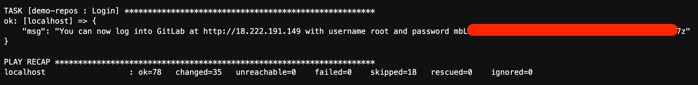

# Policy as Code

Welcome to my Policy as Code workshop!

The Cloud is enabling businesses to quickly adopt and use technology in ways that we've never imagined before. Security teams need to find ways to keep up;
automation is the solution. By using Policy as Code tools we can define and enforce security guardrails. This allows developers and cloud engineers to continue
shipping features while bringing the confidence to everybody that security requirements are being met.

In this lab, we get hands-on with pipelines and container runtimes, learn how to distribute the enforcement of our Governance, and centralizing our
observability of the environment.

## Agenda

```{toctree}
---
caption: Agenda
maxdepth: 1
---
```

1. [Getting started](getting-started)
1. [PaC in Pipelines](pac-in-pipelines)
1. [Example 1 - Infrastructure as Code](infrastructure-as-code)
1. [Example 2 - Dockerfiles](dockerfiles)

## Getting started

```{important}
This lab expects that you have an AWS Cloud9 environment configured. Step by step instructions to create a Cloud9 environment are available
<a href="../ref/aws_cloud9.html" target="_blank" rel="noopener">here</a>.
```

Run the following inside your Cloud9 IDE to setup the lab environment:

First, configure the IP variable with your public IP - to find it, [go here](https://ipv4.icanhazip.com/).

```{code-block} bash
---
class: getting-started
---
export CLIENT_IP=X.X.X.X # TODO: Replace this with your IP
```

Now, run the lab setup container.

```{code-block} bash
---
class: getting-started
---
docker run -e C9_PROJECT -e CLIENT_IP -e HOST_USER="${USER}" --network host -v ~/logs:/root/logs -v ~/.ssh:/root/.ssh jonzeolla/labs:policy-as-code
```

Then, you will need to wait for a while as the automation configures your enviornment. At the end you should see a message like this:



Use the provided credentials and URL to login to the GitLab instance. You're now ready to get started on the lab!

## Terminology

- **Governance**: the process of making and enforcing decisions within an organization, and includes the process of choosing and documenting how an organization
  will operate.
- **Policy**: a statement of intent to be used as a basis for making decisions, generally adopted by members of an organization. Policies are often implemented
  as a set of standards, procedures, guidelines, and other blueprints for organizational activities.
- **Policy as Code (PaC)**: the use of software and configurations to programmatically define and manage rules and conditions. Examples of popular languages used to
  implement Policy as Code include YAML, Rego, Go, and Python.

For more background on cloud native policy as code, see the CNCF white papers on
[Policy](https://github.com/kubernetes/sig-security/blob/769edfa3fbcbefcf8a4a1c623ee3fe486724a17f/sig-security-docs/papers/policy/CNCF_Kubernetes_Policy_Management_WhitePaper_v1.pdf)
and
[Governance](https://github.com/kubernetes/sig-security/blob/769edfa3fbcbefcf8a4a1c623ee3fe486724a17f/sig-security-docs/papers/policy_grc/Kubernetes_Policy_WG_Paper_v1_101123.pdf).

## PaC in Pipelines

Policy as Code applies across the entire lifecycle of development, from early software design and development, building and distributing code and images,
deployment of those artifacts, and finally production runtime. In this lab, we will be focusing on Policy as Code tooling that can be used in pipelines to
detect and prevent mistakes from being deployed to production.

We will be using a very simple demo repository to show, currently stored in `~/environment/policy-as-code-demo`. Go ahead and open this folder in your Cloud9 IDE.

I've pre-created an SSH private key in `~/.ssh/gitlab` and a public key in `~/.ssh/gitlab.pub`, as well as a configuration in `~/.ssh/config`.

Follow the steps [here](https://docs.gitlab.com/ee/user/ssh.html#add-an-ssh-key-to-your-gitlab-account) to add your SSH public key to your user in GitLab.

Once that's complete, run the following commands to push the `policy-as-code-demo` into GitLab.

```{code-block} console
$ export EXTERNAL_IP="$(grep ^Host ~/.ssh/config | awk '{print $2}')"
$ ssh-keyscan -p 2222 "${EXTERNAL_IP}" >> "${HOME}/.ssh/known_hosts"
$ cd ~/environment/policy-as-code-demo
$ git remote remove origin
$ git remote add origin ssh://git@${EXTERNAL_IP}:2222/demo/policy-as-code-demo.git
$ git push --all origin
Enumerating objects: 6, done.
Counting objects: 100% (6/6), done.
Delta compression using up to 4 threads
Compressing objects: 100% (4/4), done.
Writing objects: 100% (6/6), 1.82 KiB | 1.82 MiB/s, done.
Total 6 (delta 0), reused 5 (delta 0), pack-reused 0
To ssh://3.134.105.97:2222/demo/policy-as-code-demo.git
 * [new branch]      main -> main
```

When you are prompted `Are you sure you want to continue connecting (yes/no)?` you can respond with `yes` and press enter.

### Infrastructure as Code

Merge the `feat/iac` branch into `main`. In theory, this should test and deploy some Infrastructure as Code, including at least one EC2 server.

How do we know that EC2 server is configured securely? Well, so far we don't.

Let's add some Policy scans into our pipeline, using an open source tool `easy_infra`.

Now merge the `policy/iac` branch into `main`. What happened?

```{admonition} Answer
---
class: dropdown hint
---
The pipeline should fail with security findings.

Our policy is that all EC2 instances must use encrypted EBS volumes, and the configuration that was used did not have encrypted disks (among other problems).
```

### Dockerfiles

`Dockerfile`s are a set of instructions for docker to use to build an image. In most cases, when you build an image, especially when on behalf of a company,
you'd like to ensure that certain fields are always set, such as the OCI Image spec's [pre-defined annotation
keys](https://github.com/opencontainers/image-spec/blob/93f6e65855a1e046b42afbad0ad129a3d44dc971/annotations.md#pre-defined-annotation-keys).

It is a common practice to want to provide labels in your docker images with certain information, such as the company. Here is an example `Dockerfile`:

```{code-block} Dockerfile
---
class: no-copybutton
---
FROM ubuntu:22.04

ARG VERSION
ARG COMMIT_HASH

LABEL org.opencontainers.image.title="A Policy as Code demo"
LABEL org.opencontainers.image.description="A Policy as Code demonstration repository"
LABEL org.opencontainers.image.version="${VERSION}"
LABEL org.opencontainers.image.vendor="Jon Zeolla"
LABEL org.opencontainers.image.url="https://jonzeolla.com"
LABEL org.opencontainers.image.source="https://github.com/JonZeolla/policy-as-code-demo"
LABEL org.opencontainers.image.revision="${COMMIT_HASH}"
LABEL org.opencontainers.image.licenses="NONE"

ENTRYPOINT echo "Hello, World!"
```

In it we can see that some fields are set, including a `vendor` of "Jon Zeolla". Perhaps this project was done by Jon, but on behalf of his company and as an
organization we'd like all of our developers to specify the correct organizational name in the `vendor` field. We can enforce that with Policy as Code!

```{admonition} Learn more
---
class: seealso
---
To see the `Dockerfile` specification, see the documentation [here](https://docs.docker.com/engine/reference/builder/).
```

However, first we need to make sure that our environment is working properly. Browse to the URL provided at the end of the Cloud9 setup output and login as the
`root` user and the provided password.

Now, browse to the `policy-as-code-demo` repository, and take a look at the pipelines. It should look something like this:


```{admonition} Can't find it?
---
class: dropdown hint
---
If you're having a hard time finding the `policy-as-code-demo` repo, and the corresponding pipeline, try going to the below URL, replacing <IP> with the IP
provided at the end of the setup:
`http://<IP>/root/policy-as-code-demo/-/pipelines`
```

TODO: dockerfile_lint (wip: policy/dockerfile)

TODO: easy_infra scan (wip: feat/iac branch, need policy/iac branch)


## Policy as Code - Distribute

In version 2 of the CNCF [Cloud Native Security
Whitepaper](https://github.com/cncf/tag-security/blob/765806fb66f3e75bd98a52391e2fee7904518752/security-whitepaper/v2/CNCF_cloud-native-security-whitepaper-May2022-v2.pdf), we lay out a variety of Cloud Native "Layers."


You can see that each of these layers is a part of the overall story of, and Policy as Code has a place for each one of them.

## Policy as Code assessment outputs

### OSCAL

NIST's [Open Security Controls Assessment Language](https://pages.nist.gov/OSCAL/) is currently the most well-designed and adopted framework for articulating
the state of security controls and security assessments. While it is still in its infancy, it has been [in development](https://github.com/usnistgov/OSCAL) for
many years, having its first release in mid-2019.

[OSCAL Artifacts](https://github.com/cloud-native-security-controls/controls-catalog/actions/runs/6567874445)

The assessment layer is planned to be [expanded in OSCAL 2.0](https://pages.nist.gov/OSCAL/concepts/layer/) to support the automation of assessment activities.

In [this video](https://cdnapisec.kaltura.com/index.php/extwidget/preview/partner_id/684682/uiconf_id/31013851/entry_id/1_xtpgjdke/embed/dynamic) (skip to about
4:40 for the first mention), David Waltermire discusses how OSCAL is optimized for a controls-based risk assessment approach.

Supports YAML, JSON, and XML-based outputs via their [Metaschema](https://github.com/usnistgov/metaschema) project, although some projects have been adopting
graph-based views of OSCAL data to better represent relationships, such as using [Neo4j](https://github.com/Agh42/oscal4neo4j).

[Pydantic data models](https://github.com/RS-Credentive/oscal-pydantic) have also been developed to support the validation of OSCAL data as it passes between
systems, and is particularly valuable in supporting API-driven development by integrated into projects such as [FastAPI](https://fastapi.tiangolo.com/).

Numerous projects adopting OSCAL, including [FedRAMP Automation](https://github.com/GSA/fedramp-automation) from the GSA,

[12 Essential Requirements for Policy Enforcement and Governance with
OSCAL](https://www.youtube.com/watch?v=7pbIVjSluMs&list=PLj6h78yzYM2NQ-Zi_k5qVmZyxSmLBzM6V&index=53) by Robert Ficcaglia at CloudNativeSecurityCon 2023.

Other interesting projects include [Lula](https://github.com/defenseunicorns/lula) which ingests OSCAL and builds on top of [Kyverno](https://kyverno.io/) to
automate control validation at runtime.

And if you're interested in getting your hands dirty, Go developers will probably want to look at Defense Unicorn's
[go-oscal](https://github.com/defenseunicorns/go-oscal) or GoComply's [OSCALKit](https://github.com/GoComply/oscalkit), and Python developers could leverage the
models in IBM's [compliance-trestle](https://github.com/IBM/compliance-trestle/).

Another interesting project uses OSCAL models and [generates diagrams](https://github.com/cyght-io/oscal-diagrams) to help visualize your security controls.

## Runtime Policy as Code tools

Other popular Runtime Policy as Code tools include [OPA/Gatekeeper](https://open-policy-agent.github.io/gatekeeper/website/) and their flexbile, multi-purpose
[Rego](https://www.openpolicyagent.org/docs/latest/policy-language/) policy language, as well as [Kyverno](https://kyverno.io/) which is a Kubernetes-only
policy engine to support validation and enforcement of policy in a kubernetes cluster.

[Falco](https://falco.org/) also support powerful policy monitoring capabilities focused on container and system runtimes, via their [eBPF](https://ebpf.io/)
support.

## Congratulations 🎉

Great work! You've finished the lab.

If you're interested in more work like this, please stay tuned. I will be updating this lab in the coming weeks, as well as writing and running [additional
labs](../labs/index.rst) soon.

Have any ideas or feedback on this lab? Connect with me [on LinkedIn](https://linkedin.com/in/jonzeolla/) and send me a message.

If you'd like more content like this, check out SANS [SEC540 class](http://sans.org/sec540) for 5 full days of Cloud Security and DevSecOps training.

### Cleanup

When you're done with the lab, don't forget to clean up your Cloud9 environment! Deleting the environment will terminate the EC2 instance as well.

## Appendix: Common Issues

### Finding your root password

```{code-block} bash
cat ~/logs/entrypoint.log
```
