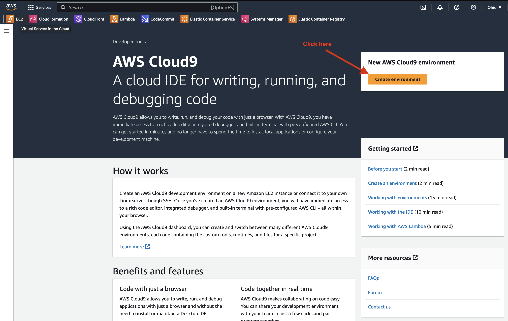
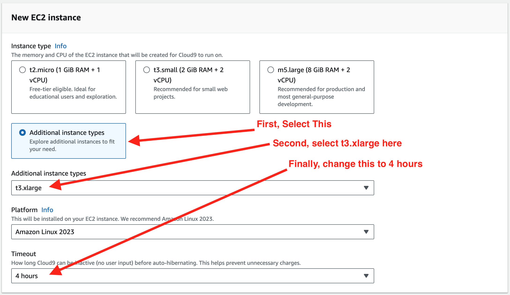

# Configuring AWS Cloud9

To provision a fresh Cloud9 environment, follow these steps:

1. Search for Cloud9 in the AWS console.

    

1. Then, click "Create Environment."

    

1. Now, fill in a name for the Cloud9 environment, such as "Workshop."

    

1. Select the `t3.xlarge` instance type.

    

1. Scroll down to the bottom and click "Create."

    

1. Now you can Open the Cloud9 environment.

    

1. You may see that your Cloud9 environment is still creating. This is expected, for at least a couple of minutes.

    

After provisioning is complete, after opening your Cloud9 environment, you should see something like this:

