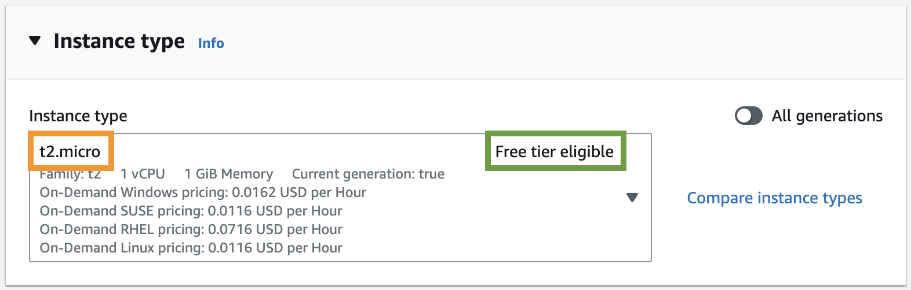
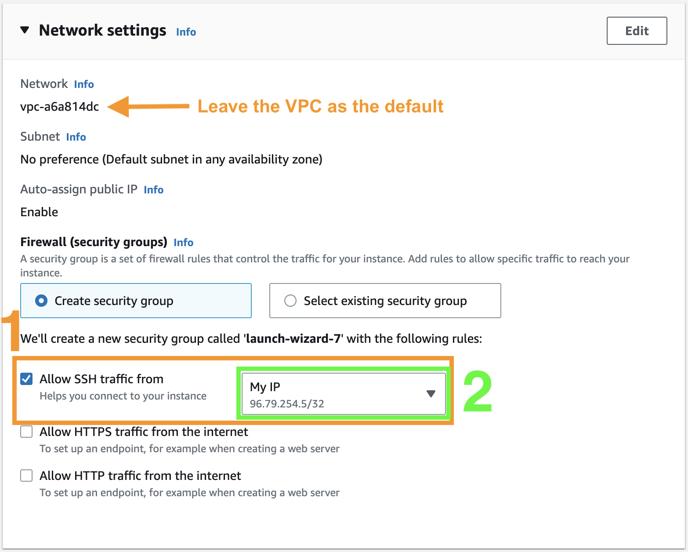
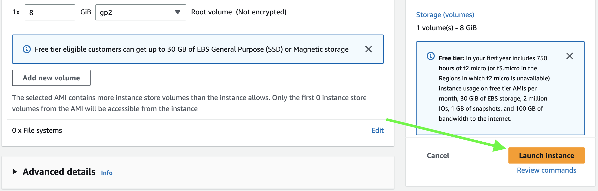
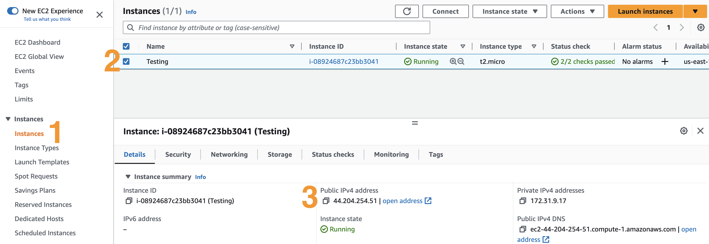
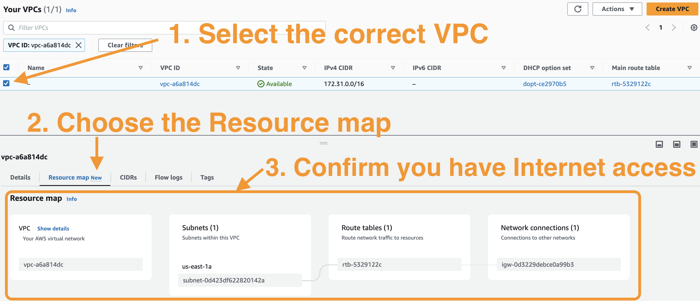

# Creating an Ubuntu 20.04 x86 server in AWS

## Setup

1. First, login to the AWS console where you want to create the EC2 instance by following [these AWS
instructions](https://docs.aws.amazon.com/signin/latest/userguide/console-sign-in-tutorials.html).
1. If you're launching an EC2 instance for the first time, follow [these setup
steps](https://docs.aws.amazon.com/AWSEC2/latest/UserGuide/get-set-up-for-amazon-ec2.html).

## Get Started

1. Open the [Amazon EC2 console](https://console.aws.amazon.com/ec2/).
1. From the EC2 console dashboard, in the **Launch instance** box, choose **Launch instance**, and then choose **Launch instance** from the options
   that appear.
1. Under Name and tags, for Name, enter a descriptive name for your instance.
1. Under **Application and OS Images (Amazon Machine Image)**, choose Quick Start, and then choose Ubuntu 20.04 LTS.

    

1. Specify an appropriate instance type, such as `t2.micro`.

    

1. Under Key pair (login), for Key pair name, choose the key pair that you created when getting set up.
1. When configuring the Network settings, follow these steps to ensure you will properly have Internet access outbound and SSH access inbound:

    

1. Click the "Launch Instance" button:

    

## Login and Validate Internet access

Now that you have a server, you should be able to SSH into it, and quickly check for Internet access.

In order to SSH in you will need to locate the SSH key that you chose when launching the EC2 instance, and you will need to find the IP address that
AWS assigned to your EC2 Instance.

```{admonition} Finding your EC2 Instance's IP Address
---
class: dropdown tip
---
In order to find your server's IP address, go to your AWS EC2 "Instances" page, select the server you created, and copy the "Public IPv4 address"

```

Store the SSH key path and IP address in variables for use later:

:::{admonition} Example
---
class: caution
---
Replace values of the below two variables with your SSH key location and IP address.

```{code-block} console
$ SSH_KEY="~/.ssh/EXAMPLE_KEY.pem"
$ IP_ADDRESS="EXAMPLE_IP"
```
:::

Once you have the location of your SSH key and your EC2 instance's IP address, you can run the following command:

```{code-block} console
$ ssh -i "${SSH_KEY}" ubuntu@"${IP_ADDRESS}"
```

If you were greeted with a wall of text (the "Message Of The Day"), you can then run the following command in your EC2 instance:

```{code-block} console
$ if [[ $(curl -s -o /dev/null -w "%{http_code}\n" https://www.google.com/) == "200" ]]; then echo "Success!"; else echo "Failed to access google.com"; fi
Success!
```

If you received a "Success!", then you are good to go and should be able to resume your lab.

:::{admonition} Click Here if Internet Access Failed
---
class: dropdown error
---
If you failed to access google.com, it is likely that the subnet you used or created doesn't have Internet access. You can use the following to
begin troubleshooting.



Also, you may want to refer to [these steps](https://repost.aws/knowledge-center/nat-gateway-vpc-private-subnet)
:::
